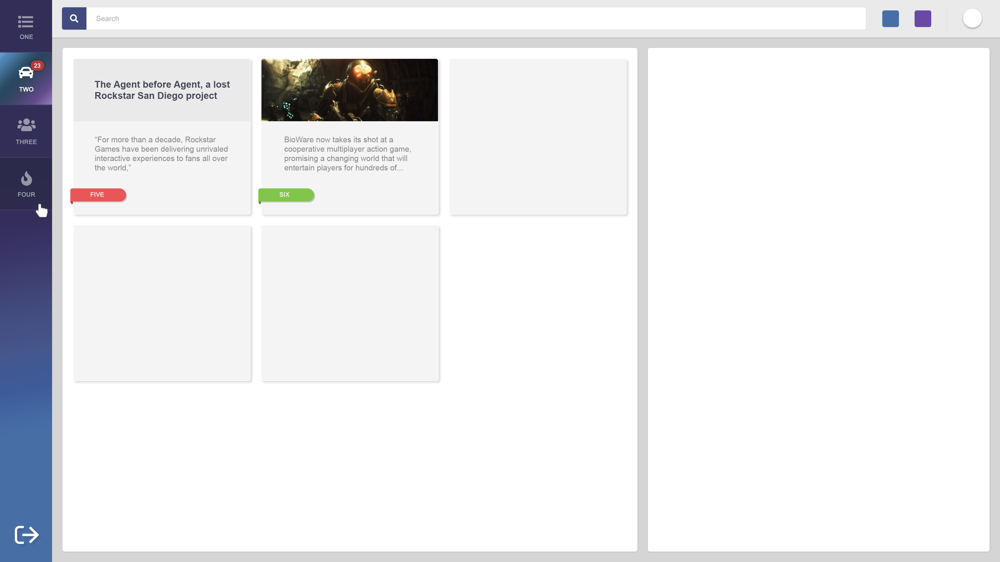

# HTML/CSS User Test

El objetivo de este ejercicio es poder comprobar el nivel de conocimiento sobre la
materia y poder observar la forma en que se trabajan ciertas problemáticas.


Se debe maquetar correctamente la pieza brindada en PNG y PSD. Se brinda el
 original por si el usuario lo considera útil para su trabajo.

### A tener en cuenta:

- Se debe armar el archivo HTML a criterio a partir del diseño.
- Se debe usar un archivo externo de CSS. Se podrá usar algún framework como Sass o Less según preferencia.
- No recomendamos usar librerías CSS para este ejercicio.
- El mismo debe verse correctamente en Chrome, Firefox, Edge, Internet Explorer 11.
- El diseño debe ser responsive y ocupar el 100% del alto y ancho, siendo 1024x768 el menor tamaño posible.
- El muestreo de cajas por fila deberá variar dependiendo del ancho de la pantalla, siendo el ancho ideal el de la muestra, podrá agrandarse o achicarse para lograr el objetivo. No deben variar los espacios entre ellas.
- Los iconos son ilustrativos, pueden usarse otros o descargarse desde fontawesome.com.
- Se deberá entregar en ZIP o RAR. En caso de usar Less o Sass deberá estar linkeado al CSS compilado pero también incluirse el original.

###### Source: "CSS Test.pdf" provided by _InvGate®_.

---

# Approach

Since I'm currently (_March 2019_) **learning Webpack** and bundling in general, I decided to do this **one-page front-end technical test** using it. It uses HTML, CSS/SASS and Vanilla JavaScript as main languages.

## Expected frontend:



###### Image provided by _InvGate®_.

---

# Check out the final project:

## a. Open HTML file

You can simply open the `/dist/index.html` file and that will do the job!

## b. Run _Webpack Dev Server_ (WDS):

```bash
# Install dependencies
$ cd path/to/test--invgate-maquetador-web-master && npm install
# Run WDS and open page on default browser
$ npm run dev
# OR
# Run WDS on port 0.0.0.0 and open page on default browser
# Port can be modified in "package.json" under:
# scripts.local "--host 0.0.0.0"
$ npm run local
```
